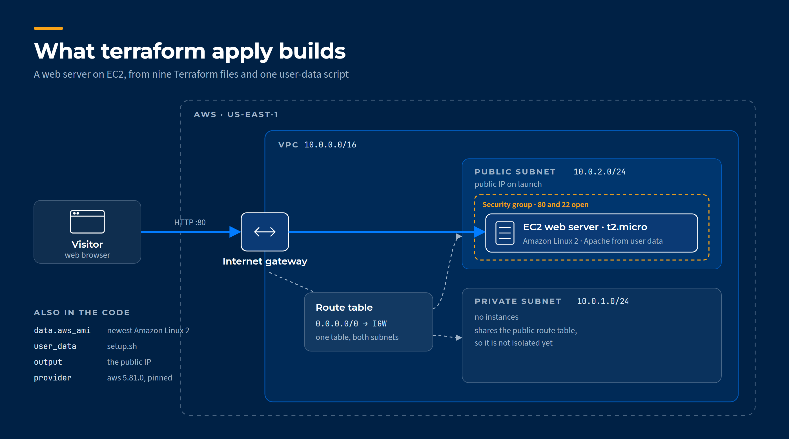

# Deploy a Web Server on AWS EC2 with Terraform

A small, complete piece of infrastructure as code. One `terraform apply` builds a VPC, its
networking, a security group and an EC2 instance that installs Apache on first boot and serves a
page reporting its own public IP and region. One `terraform destroy` removes all of it.

Built in January 2025 as hands-on infrastructure-as-code practice by
[Muhammad Sadique](https://www.linkedin.com/in/muhammad-sadique-i987/), Lead Infrastructure Engineer,
and deployed to my own AWS account, where it built the intended infrastructure.
More write-ups live on the [project wiki](https://github.com/git-muhammad-sadique-i987/projects/wiki/Welcome-to-My-GitHub-Wiki).



---

## What it builds

| Resource | Terraform name | Configuration |
|---|---|---|
| VPC | `aws_vpc.lab_vpc` | `10.0.0.0/16`, tagged `Lab-VPC` |
| Public subnet | `aws_subnet.public_subnet` | `10.0.2.0/24`, public IP assigned on launch |
| Second subnet | `aws_subnet.private_subnet` | `10.0.1.0/24`, no instances |
| Internet gateway | `aws_internet_gateway.lab_igw` | Attached to the VPC |
| Route table | `aws_route_table.lab_rt` | `0.0.0.0/0` to the internet gateway, associated with both subnets |
| Security group | `aws_security_group.lab_sg` | Inbound HTTP (80) and SSH (22) from anywhere, all outbound |
| AMI lookup | `data.aws_ami.latest_amazon_linux` | Newest Amazon-owned image matching `amzn2-ami-hvm-*-x86_64-gp2` |
| EC2 instance | `aws_instance.WebServerInstance` | `t2.micro` in the public subnet, bootstrapped by `setup.sh` |
| Output | `WebServerPublicIp` | The instance's public IP |

Terraform works out the build order from the references between resources. The subnets wait for
the VPC, the route waits for the internet gateway, and the instance waits for its subnet, its
security group and the AMI lookup. Nothing is ordered by hand.

## How the web server configures itself

The instance boots with [`setup.sh`](ec2/setup.sh) as user data. On first start it:

1. Updates the system and installs Apache (`httpd`), then starts it.
2. Reads its region and public IPv4 address from the EC2 instance metadata service.
3. Writes a one-line landing page: `Hello World from <public IP> and <region>`.
4. Enables Apache so it survives a reboot.

Because the page is generated on the instance itself, it shows exactly which machine and region
answered the request.

---

## Run it

### Prerequisites

- [Terraform](https://developer.hashicorp.com/terraform/install) 1.3 or later. The AWS provider is pinned to `5.81.0`, and `.terraform.lock.hcl` fixes the exact build.
- AWS credentials for an account you can create resources in. Short-lived credentials from IAM Identity Center (`aws configure sso`, then `aws sso login`) are better than long-lived access keys.
- An EC2 key pair in `us-east-1`. The code expects one named `Siddique_Key`. Create one with that name, or change `key_name` in [`ec2Instance.tf`](ec2/ec2Instance.tf) to a key pair you already have.

### Deploy

> [!NOTE]
> Run every command from inside `ec2/`. The instance loads `setup.sh` by a path relative to the
> working directory.

```bash
cd ec2
terraform init
terraform plan
terraform apply
```

### Check it works

```bash
terraform output WebServerPublicIp
```

Open `http://<that IP>` in a browser. Give the instance a minute or two after `apply` finishes,
while user data installs Apache. The page should read
`Hello World from <public IP> and us-east-1`.

### Tear it down

> [!TIP]
> Destroy the stack when you are done. A `t2.micro` and its public IPv4 address cost little, but
> they cost something every hour they run.

```bash
terraform destroy
```

---

## Project structure

```text
.
├── README.md
├── docs/
│   ├── architecture.svg     diagram source
│   └── architecture.png     diagram, rendered
├── ec2/
│   ├── main.tf              Terraform and AWS provider versions, region
│   ├── vpc.tf               the VPC
│   ├── subnets.tf           public and private subnets
│   ├── IGW.tf               internet gateway
│   ├── Route-Table.tf       route table, default route, subnet associations
│   ├── SecurityGroup.tf     inbound HTTP and SSH, all outbound
│   ├── AMI-ID.tf            newest Amazon Linux 2 image lookup
│   ├── ec2Instance.tf       the web server
│   ├── setup.sh             user data: Apache and the landing page
│   ├── output.tf            public IP output
│   └── .terraform.lock.hcl  provider lock file
└── Screen Shots/            the configuration as written in VS Code
```

Splitting the configuration into one file per resource type keeps each change small and easy to
review. Terraform reads every `.tf` file in the directory as one configuration, so the split costs
nothing at run time.

State stays on the machine that ran `apply` and is never committed. The repository's `.gitignore`
excludes `*.tfstate` and `.terraform/`.

---

## What I would change for production

This is a learning build, and it takes shortcuts that are fine in a short-lived lab but not in a
real environment. Reviewing it now, these are the changes I would make, most important first.

> [!WARNING]
> SSH is open to the whole internet in this build. If you reuse the code, restrict port 22 before
> you deploy anything you care about.

**1. Make the private subnet private.** Both subnets share the route table with the default route
to the internet gateway, so the "private" subnet is private in name only. It needs its own route
table without that route, and a NAT gateway or VPC endpoints if its instances need outbound access.

**2. Close SSH, or narrow it.** Limit port 22 to an administrator's address, or drop it and manage
the instance through AWS Systems Manager Session Manager, which needs no inbound port at all.

**3. Move to Amazon Linux 2023.** Amazon Linux 2 reached end of support on 30 June 2026, so the
AMI filter now finds an image that no longer receives updates. Filter on `al2023-ami-2023.*-x86_64`
instead and use `dnf` in place of `yum` in `setup.sh`.

**4. Require IMDSv2.** `setup.sh` reads instance metadata with plain requests, which only work while
the older IMDSv1 is allowed. Amazon Linux 2023 requires IMDSv2 by default, so this change has to go
together with the previous one:

```hcl
metadata_options {
  http_endpoint = "enabled"
  http_tokens   = "required"
}
```

```bash
TOKEN=$(curl -s -X PUT "http://169.254.169.254/latest/api/token" \
  -H "X-aws-ec2-metadata-token-ttl-seconds: 21600")
REGION=$(curl -s -H "X-aws-ec2-metadata-token: $TOKEN" \
  http://169.254.169.254/latest/meta-data/placement/region)
```

**5. Turn the fixed values into variables.** The region, instance type, key pair name and CIDR
ranges are written into the resources. As variables with a `terraform.tfvars.example`, the same
code deploys anywhere. Loading the script as `file("${path.module}/setup.sh")` would also let it run
from any directory.

**6. Keep state remotely.** For anything shared, store state in an S3 backend with locking, so two
people cannot apply at once and the state survives the laptop it was created on.

**7. Serve over HTTPS.** Put an Application Load Balancer with an ACM certificate in front of the
instance, and let only the load balancer reach port 80.

---

## What this project practises

Terraform resource modelling · implicit dependency ordering through references · data sources ·
user-data bootstrapping · outputs · provider pinning and lock files · AWS VPC, subnet, route table,
internet gateway and security group design · EC2 instance metadata
